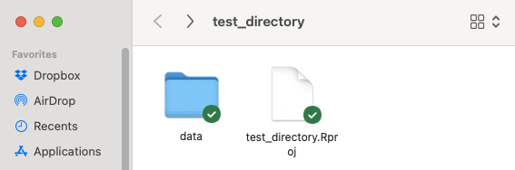
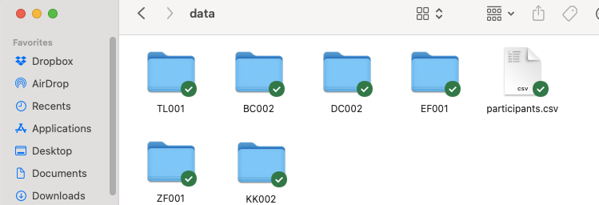
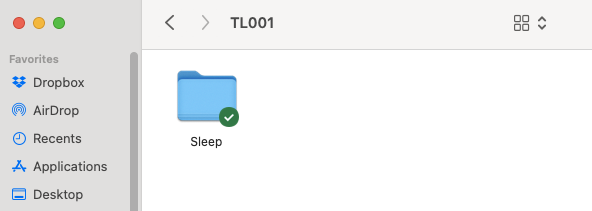
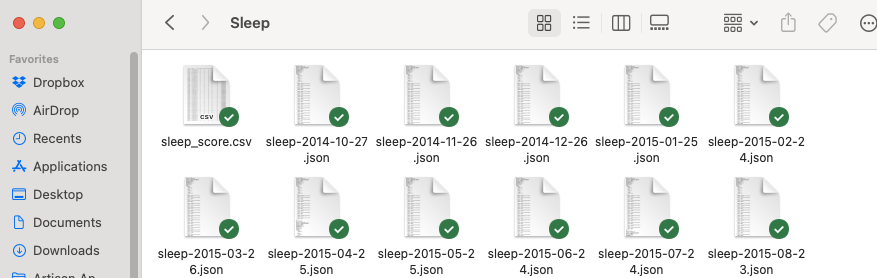

<!-- README.md is generated from README.Rmd. Please edit that file -->

# snoozr 

<!-- badges: start -->
<!-- badges: end -->

The goal of snoozr is to provide researchers with a toolkit for R to aid
in the processing, description, and modeling of sleep data collected by
FitBit trackers.

## Installation

You can install the development version of snoozr like so:

``` r
# install.packages("devtools")
devtools::install_github("trackthatsleep/snoozr")
```

## Collaboration and Troubleshooting

Please submit any problems or feature requests via the snoozr
[issues](https://github.com/trackthatsleep/snoozr/issues) page.

If you are interested in collaborating on the development of snoozr,
please contact Dr. Lillis.

## General use and required data management structure

snoozr currently has two primary user-facing functions to help with data
extraction and processing: (1) `scrapePerson()` and (2)
`scrapeSample()`. Both `scrapePerson()` and `scrapeSample()` requires:

1.  a user to have a folder called “data” in the current working
    directory ([using R Projects is a good idea to ensure correct
    targeting of your intended
    directory](https://r4ds.hadley.nz/workflow-scripts.html))…



2.  in which there would be one or more subdirectories corresponding to
    data exported from a FitBit account for a particular user…



3.  in which (of each of 2.) there would be a subdirectory called
    “Sleep”…



4.  in which there would be one or more .json files containing the sleep
    data:



## scrapePerson()

`scrapePerson()` is the function to use when you wish to convert the
.json files of *one* user, into a flattened data frame for further
description, visualization, and/or analysis. At bare minimum,
`scrapePerson()` requires that you indicate the user id (i.e.,
subdirectory name) to target:

``` r
tl001.df <- scrapePerson(idTarget ="TL001")
```

By default, `scrapePerson()` extracts event-level data, but it can
optionally aggregate over a day if that format of data is preferred:

``` r
tl001.df <- scrapePerson(idTarget ="TL001", type = "day")
```

If you prefer to also extract more granular 30-second epoch data, there
is an option for this as well, though be aware that parsing of this
resolution can be quite time-consuming. When this option is set to TRUE,
the data frame returned repeats event-level data for each instance of
unique 30-second epoch data (i.e., it returns a dataset amenable to
multilevel modeling)

``` r
tl001.df <- scrapePerson(idTarget ="TL001", epoch30 = TRUE)
```

Other potentially helpful options include:

- `birthdf = TRUE`: to use a provided .csv (with data on participant
  infant birth-dates) to code for pregnancy phases
- `export = TRUE`: to export a .csv of the participant’s data to your
  working directory (e.g., for use in other programs)
- `anon = TRUE`: to return a data frame with anonymized participant ID’s
  (instead of subdirectory names); particularly useful if you are
  anticipating to export the data and share with others

## scrapeSample()

`scrapeSample()` is the function to use when you wish to convert the
.json files of *all* users, into a flattened data frame for further
description, visualization, and/or analysis. Its arguments mostly
parallel those of `scrapePerson()`, and users need not supply a target
ID (as in `scrapePerson()`) as `scrapeSample()` will simply identify all
unique subdirectories (i.e., for each participant) in your data
subdirectory. Users should be aware that using `scrapeSample()` with
`epoch30 = TRUE` can be especially time-consuming.

``` r
samp.df <- scrapePerson(epoch30 = TRUE)
```
